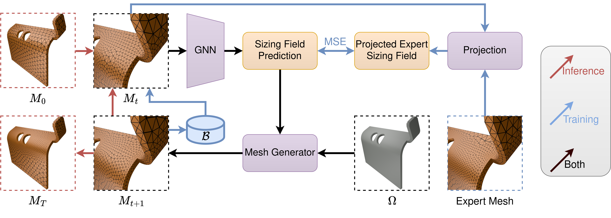

# Adaptive Meshing By Expert Reconstruction (AMBER)

[Iterative Sizing Field Prediction for Adaptive Mesh Generation From Expert Demonstrations](https://arxiv.org/abs/2406.14161)

##  Abstract
Many engineering systems require accurate simulations of complex physical systems. 
Yet, analytical solutions are only available for simple problems, necessitating numerical approximations such as the Finite Element Method (FEM). 
The cost and accuracy of the FEM scale with the resolution of the underlying computational mesh. 
To balance computational speed and accuracy meshes with adaptive resolution are used, allocating more resources to critical parts of the geometry. 
Currently, practitioners often resort to hand-crafted meshes, which require extensive expert knowledge and are thus costly to obtain.
Our approach, Adaptive Meshing By Expert Reconstruction (AMBER), views mesh generation as an imitation learning problem. 
AMBER combines a graph neural network with an online data acquisition scheme to predict the projected sizing field of an expert mesh on a given intermediate mesh, creating a more accurate subsequent mesh. 
This iterative process ensures efficient and accurate imitation of expert mesh resolutions on arbitrary new geometries during inference.
We experimentally validate AMBER on heuristic $2$D meshes and $3$D meshes provided by a human expert, closely matching the provided demonstrations and outperforming a single-step CNN baseline.



# Getting Started

## Setting up the environment

### Mamba
This project uses conda (https://docs.conda.io/en/latest/) and pip for handling packages and dependencies.
To get faster package management performance, you can also use mamba instead of conda (https://github.com/conda-forge/miniforge#mambaforge).
To install mamba on Linux-like OSes use one of the commands below.

```
curl -L -O "https://github.com/conda-forge/miniforge/releases/latest/download/Mambaforge-$(uname)-$(uname -m).sh"
bash Mambaforge-$(uname)-$(uname -m).sh
```

or

```
wget "https://github.com/conda-forge/miniforge/releases/latest/download/Mambaforge-$(uname)-$(uname -m).sh"
bash Mambaforge-$(uname)-$(uname -m).sh
```

For Windows please see the documentation in the link above or use (not recommended).
```
conda install -c conda-forge mamba
```

### External Packages

This project uses external packages that are under active development. They are provided as git submodules
in `./dependencies.
They will be automatically installed when setting up the environment if available, but may need to be
updated manually. To do so, run `git pull --recurse-submodules` in the root directory of the project.
U
Afterward, you should be able to install all requirements using the commands below:

```
# for cpu use
mamba env create -f ./env/environment-cpu.yaml
mamba activate AMBER_cpu

# for gpu use
mamba env create -f ./env/environment-cuda.yaml
mamba activate AMBER_cuda

# dont forget to login into wandb
wandb login
```

### Test the environment
Test if everything works by running an experiment:

```bash
python main.py configs/amber/tests.yaml -e amber_test -o
```

## Creating an experiment

Experiments are configured and distributed via cw2 (https://www.github.com/ALRhub/cw2.git). For this, the folder `configs` contains
a number of `.yaml` files that describe the configuration of the task to run. The configs are composed of individual
_experiments_, each of which is separated by three dashes and uniquely identified with an `$EXPERIMENT_NAME$`.

To run an experiment from any of these files on a local machine, type
`python main.py configs/$FILE_NAME$.yaml -e $EXPERIMENT_NAME$ -o`.

To start an experiment on a cluster that uses Slurm
(https://slurm.schedmd.com/documentation.html), run
`python main.py configs/$FILE_NAME$.yaml -e $EXPERIMENT_NAME$ -o -s --nocodecopy`.

Running an experiment essentially provides a (potentially nested) config dictionary that can be used to specify e.g., an
algorithm, a task and a dataset, each of which may or may not include their own parameters. For more information on how
to use this, refer to the cw2 docs.

## Project Structure

### Recording

We provide a logger for all console outputs, different scalar metrics and task-dependent visualizations per iteration.
The scalar metrics may optionally be logged to the [wandb dashboard](https://wandb.ai).
The metrics and plot that are recorded depend on both the task and the algorithm being run.

All locally recorded entities are saved the `reports` directory, where they are organized by their experiment and repetition.

### Configs
`config` contains a hierarchy of configuration files for the experiments that are compatible with cw2.
The `default.yaml` file is the most general, with other files building off of it to create more specific sets of
experiments.


### Reports

`reports` contains everything that your loggers pick up.
That may be simple logs of metrics like the loss and accuracy of your network, or more sophisticated things such as
visualizations of your tasks, plots over time and more.

### Source

The `src` folder contains the source code of this project, separated into the following subfolders:
* `algorithms` contains the AMBER and CNN baseline algorithms.
* `environments` contains the geometry and PDE definitions.
* `hmpn` contains the message passing network.
* `modules` contains additional pytorch modules.
* `recording` contains the logger for all console outputs, different scalar metrics and task-dependent visualizations per iteration.

### Util

Common utilities used by the entire source-code can be found here. This includes additions to torch that we need,
or common definitions.

# Cite
Please cite this work as
```
@article{freymuth2024iterative,
  title={Iterative Sizing Field Prediction for Adaptive Mesh Generation From Expert Demonstrations},
  author={Freymuth, Niklas and Dahlinger, Philipp and W{\"u}rth, Tobias and Becker, Philipp and Taranovic, Aleksandar and Gr{\"o}nheim, Onno and K{\"a}rger, Luise and Neumann, Gerhard},
  journal={AI4Science Workshop at  at International Conference on Machine Learning (ICML)},
  year={2024}
}
```

